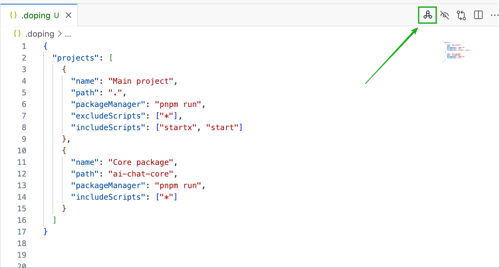
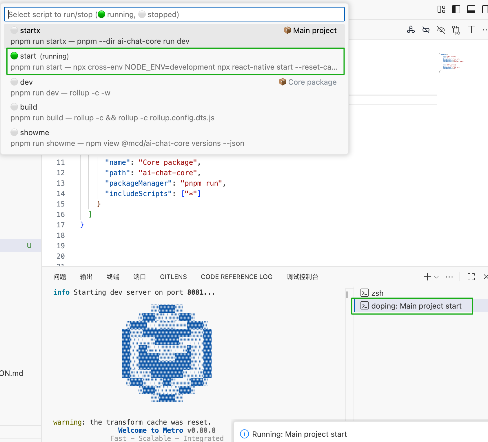
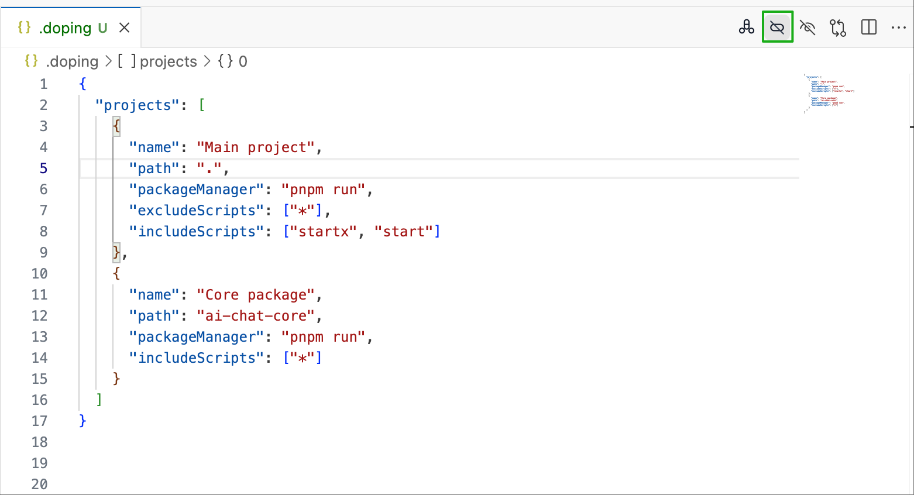

# doping

English | [中文](README.zh.md)


A VSCode extension that lets you easily run scripts from package.json. Supports multi-project management and can filter out auxiliary commands like pre/post, showing only the scripts you actually need.


## Installation

Search for "doping" in the VS Code Extensions Marketplace and install, or:

1. Press `Ctrl+Shift+X` (Windows/Linux) or `Cmd+Shift+X` (macOS) to open the Extensions panel
2. Search for "doping"
3. Click Install

## Usage

### Step 1: Open Script Menu



Click the doping icon in the top-right corner of the editor, or use the shortcut `Cmd+D` (macOS) / `Ctrl+D` (Windows/Linux)

### Step 2: Run/Stop Scripts



Click any command to run it, click the same command again to stop it

### Step 3: Stop All Running



Click the stop button in the top-right corner to stop all running scripts at once

### Menu Description

- 🟢 Indicates script is running (click to stop)
- ⚪ Indicates script is not running (click to start)
- Projects missing node_modules will show "Install dependencies" option
- Multiple scripts can run simultaneously, each in its own terminal

### Configuration File

Create a `.doping` file in the workspace root (JSONC format, supports comments):

```jsonc
{
  "cn": true,  // Enable Chinese interface, defaults to English
  "projects": [
    {
      "name": "Main App",
      "path": ".",
      "packageManager": "pnpm run",
      "excludeScripts": ["*"],
      "includeScripts": ["dev", "build", "start"]
    },
    {
      "name": "UI Library",
      "path": "packages/ui-lib",
      "packageManager": "npm",
      "includeScripts": ["build", "test"]
    }
  ]
}
```

### Configuration Options

- `cn`: Whether to use Chinese interface (defaults to false, shows English)
- `name`: Project display name (optional, defaults to directory name)
- `path`: Project relative path
- `packageManager`: Package manager command (defaults to "pnpm")
- `autoExpandProjects`: Whether to auto-expand all projects (defaults to true)
- `includeScripts`: Whitelist of scripts to show (supports glob patterns)
- `excludeScripts`: Blacklist of scripts to hide (supports glob patterns)

### Advanced Usage

#### Whitelist Mode
Use `excludeScripts: ["*"]` to exclude all scripts, then use `includeScripts` to specify which ones to show:

```jsonc
{
  "cn": true,
  "projects": [
    {
      "path": ".",
      "excludeScripts": ["*"],
      "includeScripts": ["dev", "build", "test"]
    }
  ]
}
```

#### Filter Auxiliary Scripts
Exclude pre/post and other auxiliary scripts:

```jsonc
{
  "projects": [
    {
      "path": ".",
      "excludeScripts": ["pre*", "post*"]
    }
  ]
}
```

## Feedback & Support

If you encounter any issues or have suggestions for improvement, please contact us through:

- Submit Issue: [GitHub Issues](https://github.com/name-q/doping/issues)
- Email: 1620206666@qq.com
- Feature requests and bug reports are very welcome!

## Development

To participate in development or debug locally:

1. Clone repository: `git clone https://github.com/name-q/doping.git`
2. Install dependencies: `pnpm install`
3. Build: `pnpm build`
4. Press `F5` to start debugging


## License

MIT