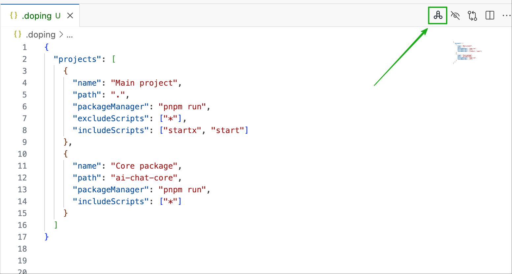

# doping

[English](README.md) | 中文


一个VSCode插件，让你轻松运行package.json中的scripts命令。支持多项目管理，可屏蔽pre/post等辅助命令，只显示你真正需要的脚本。


## 安装

在VS Code扩展商店搜索 "doping" 并安装，或者：

1. 按 `Ctrl+Shift+X` (Windows/Linux) 或 `Cmd+Shift+X` (macOS) 打开扩展面板
2. 搜索 "doping"
3. 点击安装

## 使用方法

### 步骤 1：打开脚本菜单



点击编辑器右上角的doping图标，或使用快捷键 `Cmd+D` (macOS) / `Ctrl+D` (Windows/Linux)

### 步骤 2：运行/停止脚本


点击某个命令即可运行，再次点击同一命令即可停止

### 步骤 3：停止所有运行


点击右上角的停止按钮，一键停止所有正在运行的脚本

### 菜单说明

- 🟢 表示脚本正在运行（点击可停止）
- ⚪ 表示脚本未运行（点击可启动）
- 缺少node_modules的项目会显示 "Install dependencies" 选项
- 多个脚本可同时运行，每个都在独立的终端中

### 配置文件

在工作区根目录创建 `.doping` 文件（JSONC格式，支持注释）：

```jsonc
{
  "cn": true,  // 开启中文界面，默认为英文
  "projects": [
    {
      "name": "主应用",
      "path": ".",
      "packageManager": "pnpm run",
      "excludeScripts": ["*"],
      "includeScripts": ["dev", "build", "start"]
    },
    {
      "name": "UI库",
      "path": "packages/ui-lib",
      "packageManager": "npm",
      "includeScripts": ["build", "test"]
    }
  ]
}
```

### 配置选项

- `cn`: 是否使用中文界面（默认false，显示英文）
- `name`: 项目显示名称（可选，默认使用目录名）
- `path`: 项目相对路径
- `packageManager`: 包管理器命令（默认"pnpm"）
- `autoExpandProjects`: 是否自动展开所有项目（默认true）
- `includeScripts`: 要显示的脚本白名单（支持glob模式）
- `excludeScripts`: 要隐藏的脚本黑名单（支持glob模式）

### 高级用法

#### 白名单模式
使用 `excludeScripts: ["*"]` 排除所有脚本，然后用 `includeScripts` 指定要显示的脚本：

```jsonc
{
  "cn": true,
  "projects": [
    {
      "path": ".",
      "excludeScripts": ["*"],
      "includeScripts": ["dev", "build", "test"]
    }
  ]
}
```

#### 过滤辅助脚本
排除pre/post等辅助脚本：

```jsonc
{
  "projects": [
    {
      "path": ".",
      "excludeScripts": ["pre*", "post*"]
    }
  ]
}
```

## 反馈与支持

如果您在使用过程中遇到问题或有改进建议，欢迎通过以下方式联系：

- 提交 Issue: [GitHub Issues](https://github.com/name-q/doping/issues)
- 邮箱: 1620206666@qq.com
- 功能请求和Bug报告都非常欢迎！

## 开发者

如需参与开发或本地调试：

1. 克隆仓库: `git clone https://github.com/name-q/doping.git`
2. 安装依赖: `pnpm install`
3. 编译: `pnpm build`
4. 按 `F5` 启动调试


## 许可证

MIT